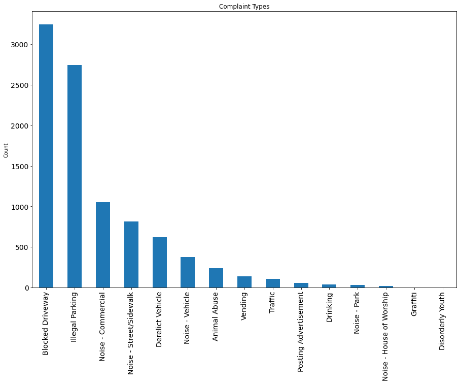
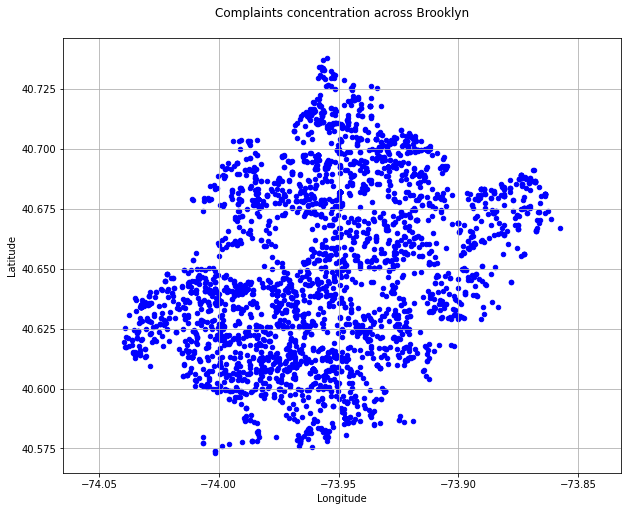
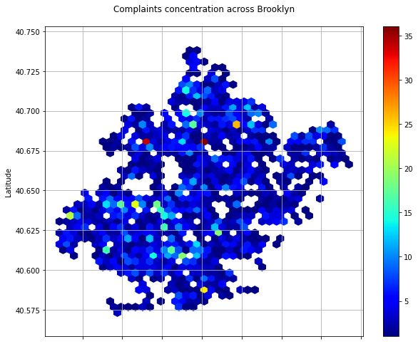
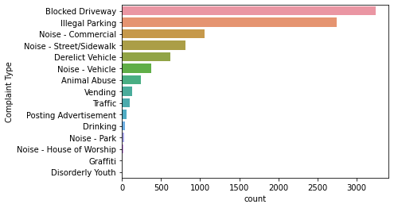
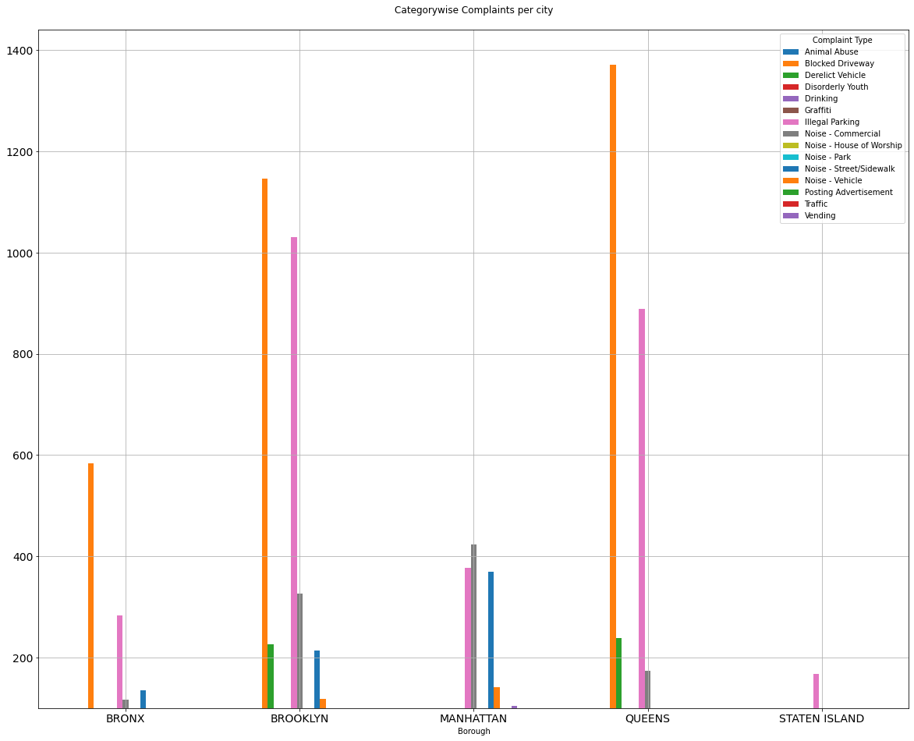

# Customer-Service-Requests-Analysis
DESCRIPTION

**Background of Problem Statement :**

The GroupLens Research Project is a research group in the Department of Computer Science and Engineering at the University of Minnesota. Members of the GroupLens Research Project are involved in many research projects related to the fields of information filtering, collaborative filtering, and recommender systems. The project is led by professors John Riedl and Joseph Konstan. The project began to explore automated collaborative filtering in 1992 but is most well known for its worldwide trial of an automated collaborative filtering system for Usenet news in 1996. Since then the project has expanded its scope to research overall information by filtering solutions, integrating into content-based methods, as well as, improving current collaborative filtering technology.

**Problem Objective :**

Here, we ask you to perform the analysis using the Exploratory Data Analysis technique. You need to find features affecting the ratings of any particular movie and build a model to predict the movie ratings.

**Domain**: Entertainment

**Analysis Tasks to be performed:**

- Import the three datasets
- Create a new dataset [Master\_Data] with the following columns MovieID Title UserID Age Gender Occupation Rating. (Hint: (i) Merge two tables at a time. (ii) Merge the tables using two primary keys MovieID & UserId)
- Explore the datasets using visual representations (graphs or tables), also include your comments on the following:
1. User Age Distribution
1. User rating of the movie “Toy Story”
1. Top 25 movies by viewership rating
1. Find the ratings for all the movies reviewed by for a particular user of user id = 2696
- Feature Engineering:  <br /> Use column genres:

1. Find out all the unique genres (Hint: split the data in column genre making a list and then process the data to find out only the unique categories of genres)
1. Create a separate column for each genre category with a one-hot encoding ( 1 and 0) whether or not the movie belongs to that genre. 
1. Determine the features affecting the ratings of any particular movie.
1. Develop an appropriate model to predict the movie ratings

**Dataset Description :**

These files contain 1,000,209 anonymous ratings of approximately 3,900 movies made by 6,040 MovieLens users who joined MovieLens in 2000.

**Ratings.dat**  <br  />  Format - UserID::MovieID::Rating::Timestamp

|**Field**|**Description**|
| :- | :- |
|UserID|Unique identification for each user|
|MovieID|Unique identification for each movie|
|Rating|User rating for each movie|
|Timestamp|Timestamp generated while adding user review|

- UserIDs range between 1 and 6040 
- The MovieIDs range between 1 and 3952
- Ratings are made on a 5-star scale (whole-star ratings only)
- A timestamp is represented in seconds since the epoch is returned by time(2)
- Each user has at least 20 ratings


**Users.dat** <br />  Format -  UserID::Gender::Age::Occupation::Zip-code

|Field|Description|
| :- | :- |
|UserID|Unique identification for each user|
|Genere|Category of each movie|
|Age|User’s age|
|Occupation|User’s Occupation|
|Zip-code|Zip Code for the user’s location|

All demographic information is provided voluntarily by the users and is not checked for accuracy. Only users who have provided demographic information are included in this data set.

- Gender is denoted by an "M" for male and "F" for female
- Age is chosen from the following ranges:


|**Value**|**Description**|
| :- | :- |
|1|"Under 18"|
|18|"18-24"|
|25|"25-34"|
|35|"35-44"|
|45|"45-49"|
|50|"50-55"|
|56|"56+"|


- Occupation is chosen from the following choices:

|**Value**<br> |**Description**|
| :- | :- |
|0|"other" or not specified|
|1|"academic/educator"|
|2|"artist”|
|3|"clerical/admin"|
|4|"college/grad student"|
|5|"customer service"|
|6|"doctor/health care"|
|7|"executive/managerial"|
|8|"farmer"|
|9|"homemaker"|
|10|"K-12 student"|
|11|"lawyer"|
|12|"programmer"|
|13|"retired"|
|14|"sales/marketing"|
|15|"scientist"|
|16|"self-employed"|
|17|"technician/engineer"|
|18|"tradesman/craftsman"|
|19|"unemployed"|
|20|"writer”|


**Movies.dat** <br />Format - MovieID::Title::Genres

|Field|Description|
| :- | :- |
|MovieID|Unique identification for each movie|
|Title|A title for each movie|
|Genres|Category of each movie|


- Titles are identical to titles provided by the IMDB (including year of release)


- Genres are pipe-separated and are selected from the following genres:
1. Action
1. Adventure
1. Animation
1. Children's
1. Comedy
1. Crime
1. Documentary
1. Drama
1. Fantasy
1. Film-Noir
1. Horror
1. Musical
1. Mystery
1. Romance
1. Sci-Fi
1. Thriller
1. War
1. Western
- Some MovieIDs do not correspond to a movie due to accidental duplicate entries and/or test entries
- Movies are mostly entered by hand, so errors and inconsistencies may exist


```python
import numpy as np
import pandas as pd
import matplotlib.pyplot as plt
```

#### Import data into Python environment ####


```python
df = pd.read_csv("311_Service_Requests_from_2010_to_Present.csv")
```


```python
df.head()
```


<div>
<style scoped>
    .dataframe tbody tr th:only-of-type {
        vertical-align: middle;
    }

    .dataframe tbody tr th {
        vertical-align: top;
    }

    .dataframe thead th {
        text-align: right;
    }
</style>
<table border="1" class="dataframe">
  <thead>
    <tr style="text-align: right;">
      <th></th>
      <th>Unique Key</th>
      <th>Created Date</th>
      <th>Closed Date</th>
      <th>Agency</th>
      <th>Agency Name</th>
      <th>Complaint Type</th>
      <th>Descriptor</th>
      <th>Location Type</th>
      <th>Incident Zip</th>
      <th>Incident Address</th>
      <th>...</th>
      <th>Bridge Highway Name</th>
      <th>Bridge Highway Direction</th>
      <th>Road Ramp</th>
      <th>Bridge Highway Segment</th>
      <th>Garage Lot Name</th>
      <th>Ferry Direction</th>
      <th>Ferry Terminal Name</th>
      <th>Latitude</th>
      <th>Longitude</th>
      <th>Location</th>
    </tr>
  </thead>
  <tbody>
    <tr>
      <th>0</th>
      <td>32310363</td>
      <td>12/31/2015 11:59:45 PM</td>
      <td>01/01/2016 12:55:15 AM</td>
      <td>NYPD</td>
      <td>New York City Police Department</td>
      <td>Noise - Street/Sidewalk</td>
      <td>Loud Music/Party</td>
      <td>Street/Sidewalk</td>
      <td>10034.0</td>
      <td>71 VERMILYEA AVENUE</td>
      <td>...</td>
      <td>NaN</td>
      <td>NaN</td>
      <td>NaN</td>
      <td>NaN</td>
      <td>NaN</td>
      <td>NaN</td>
      <td>NaN</td>
      <td>40.865682</td>
      <td>-73.923501</td>
      <td>(40.86568153633767, -73.92350095571744)</td>
    </tr>
    <tr>
      <th>1</th>
      <td>32309934</td>
      <td>12/31/2015 11:59:44 PM</td>
      <td>01/01/2016 01:26:57 AM</td>
      <td>NYPD</td>
      <td>New York City Police Department</td>
      <td>Blocked Driveway</td>
      <td>No Access</td>
      <td>Street/Sidewalk</td>
      <td>11105.0</td>
      <td>27-07 23 AVENUE</td>
      <td>...</td>
      <td>NaN</td>
      <td>NaN</td>
      <td>NaN</td>
      <td>NaN</td>
      <td>NaN</td>
      <td>NaN</td>
      <td>NaN</td>
      <td>40.775945</td>
      <td>-73.915094</td>
      <td>(40.775945312321085, -73.91509393898605)</td>
    </tr>
    <tr>
      <th>2</th>
      <td>32309159</td>
      <td>12/31/2015 11:59:29 PM</td>
      <td>01/01/2016 04:51:03 AM</td>
      <td>NYPD</td>
      <td>New York City Police Department</td>
      <td>Blocked Driveway</td>
      <td>No Access</td>
      <td>Street/Sidewalk</td>
      <td>10458.0</td>
      <td>2897 VALENTINE AVENUE</td>
      <td>...</td>
      <td>NaN</td>
      <td>NaN</td>
      <td>NaN</td>
      <td>NaN</td>
      <td>NaN</td>
      <td>NaN</td>
      <td>NaN</td>
      <td>40.870325</td>
      <td>-73.888525</td>
      <td>(40.870324522111424, -73.88852464418646)</td>
    </tr>
    <tr>
      <th>3</th>
      <td>32305098</td>
      <td>12/31/2015 11:57:46 PM</td>
      <td>01/01/2016 07:43:13 AM</td>
      <td>NYPD</td>
      <td>New York City Police Department</td>
      <td>Illegal Parking</td>
      <td>Commercial Overnight Parking</td>
      <td>Street/Sidewalk</td>
      <td>10461.0</td>
      <td>2940 BAISLEY AVENUE</td>
      <td>...</td>
      <td>NaN</td>
      <td>NaN</td>
      <td>NaN</td>
      <td>NaN</td>
      <td>NaN</td>
      <td>NaN</td>
      <td>NaN</td>
      <td>40.835994</td>
      <td>-73.828379</td>
      <td>(40.83599404683083, -73.82837939584206)</td>
    </tr>
    <tr>
      <th>4</th>
      <td>32306529</td>
      <td>12/31/2015 11:56:58 PM</td>
      <td>01/01/2016 03:24:42 AM</td>
      <td>NYPD</td>
      <td>New York City Police Department</td>
      <td>Illegal Parking</td>
      <td>Blocked Sidewalk</td>
      <td>Street/Sidewalk</td>
      <td>11373.0</td>
      <td>87-14 57 ROAD</td>
      <td>...</td>
      <td>NaN</td>
      <td>NaN</td>
      <td>NaN</td>
      <td>NaN</td>
      <td>NaN</td>
      <td>NaN</td>
      <td>NaN</td>
      <td>40.733060</td>
      <td>-73.874170</td>
      <td>(40.733059618956815, -73.87416975810375)</td>
    </tr>
  </tbody>
</table>
<p>5 rows × 53 columns</p>
</div>


##### Shape of the Dataset #####


```python
df.shape
```


    (9748, 53)


##### Check for null values #####


```python
df.isna().sum(axis = 0)
```


    Unique Key                           0
    Created Date                         0
    Closed Date                         56
    Agency                               0
    Agency Name                          0
    Complaint Type                       0
    Descriptor                         174
    Location Type                        0
    Incident Zip                        65
    Incident Address                  1090
    Street Name                       1090
    Cross Street 1                    1226
    Cross Street 2                    1242
    Intersection Street 1             8663
    Intersection Street 2             8677
    Address Type                        71
    City                                65
    Landmark                          9743
    Facility Type                       54
    Status                               0
    Due Date                             0
    Resolution Description               0
    Resolution Action Updated Date      55
    Community Board                      1
    Borough                              1
    X Coordinate (State Plane)          85
    Y Coordinate (State Plane)          85
    Park Facility Name                   1
    Park Borough                         1
    School Name                          1
    School Number                        1
    School Region                        1
    School Code                          1
    School Phone Number                  1
    School Address                       1
    School City                          1
    School State                         1
    School Zip                           1
    School Not Found                     1
    School or Citywide Complaint      9748
    Vehicle Type                      9748
    Taxi Company Borough              9748
    Taxi Pick Up Location             9748
    Bridge Highway Name               9742
    Bridge Highway Direction          9742
    Road Ramp                         9743
    Bridge Highway Segment            9743
    Garage Lot Name                   9748
    Ferry Direction                   9748
    Ferry Terminal Name               9748
    Latitude                            85
    Longitude                           85
    Location                            85
    dtype: int64


- ##### This data has a lot of null values


```python
df.columns
```


    Index(['Unique Key', 'Created Date', 'Closed Date', 'Agency', 'Agency Name',
           'Complaint Type', 'Descriptor', 'Location Type', 'Incident Zip',
           'Incident Address', 'Street Name', 'Cross Street 1', 'Cross Street 2',
           'Intersection Street 1', 'Intersection Street 2', 'Address Type',
           'City', 'Landmark', 'Facility Type', 'Status', 'Due Date',
           'Resolution Description', 'Resolution Action Updated Date',
           'Community Board', 'Borough', 'X Coordinate (State Plane)',
           'Y Coordinate (State Plane)', 'Park Facility Name', 'Park Borough',
           'School Name', 'School Number', 'School Region', 'School Code',
           'School Phone Number', 'School Address', 'School City', 'School State',
           'School Zip', 'School Not Found', 'School or Citywide Complaint',
           'Vehicle Type', 'Taxi Company Borough', 'Taxi Pick Up Location',
           'Bridge Highway Name', 'Bridge Highway Direction', 'Road Ramp',
           'Bridge Highway Segment', 'Garage Lot Name', 'Ferry Direction',
           'Ferry Terminal Name', 'Latitude', 'Longitude', 'Location'],
          dtype='object')


##### Dropping columns with large number of missing values and unnecesary columns


```python
drop_columns = ['Agency Name','Incident Address','Street Name','Cross Street 1','Cross Street 2',
                'Intersection Street 1','Intersection Street 2','Address Type','Park Facility Name',
                'Park Borough','School Name','School Number','School Region','School Code',
                'School Phone Number','School Address','School City','School State','School Zip',
                'School Not Found','School or Citywide Complaint','Vehicle Type','Taxi Company Borough',
                'Taxi Pick Up Location','Bridge Highway Name','Bridge Highway Direction','Road Ramp',
                'Bridge Highway Segment','Garage Lot Name','Ferry Direction','Ferry Terminal Name','Landmark',
                'X Coordinate (State Plane)','Y Coordinate (State Plane)','Due Date',
                'Resolution Action Updated Date','Community Board','Facility Type','Location']
df = df.drop(drop_columns, axis =1)
```


```python
df.isna().sum(axis = 0)  # Checking for null values
```


    Unique Key                  0
    Created Date                0
    Closed Date                56
    Agency                      0
    Complaint Type              0
    Descriptor                174
    Location Type               0
    Incident Zip               65
    City                       65
    Status                      0
    Resolution Description      0
    Borough                     1
    Latitude                   85
    Longitude                  85
    dtype: int64


```python
df.shape
```


    (9748, 14)


##### We have to delete null values of only closed cases 


```python
df = df[df['Status'] == 'Closed']
```


```python
df.isna().sum()
```


    Unique Key                  0
    Created Date                0
    Closed Date                 0
    Agency                      0
    Complaint Type              0
    Descriptor                174
    Location Type               0
    Incident Zip               12
    City                       12
    Status                      0
    Resolution Description      0
    Borough                     1
    Latitude                   32
    Longitude                  32
    dtype: int64


```python
# since all the cases are of closed cases we can now drop the column Status as every value of its data are same
df = df.drop(['Status'], axis = 1)
```


```python
df.shape
```


    (9692, 13)


```python
df.isna().sum()/df.shape[0]*100
```


    Unique Key                0.000000
    Created Date              0.000000
    Closed Date               0.000000
    Agency                    0.000000
    Complaint Type            0.000000
    Descriptor                1.795295
    Location Type             0.000000
    Incident Zip              0.123813
    City                      0.123813
    Resolution Description    0.000000
    Borough                   0.010318
    Latitude                  0.330169
    Longitude                 0.330169
    dtype: float64


```python
df = df[(df['Descriptor'].notnull()) & (df['Latitude'].notnull()) &(df['Longitude'].notnull())]
df.info()
```

    <class 'pandas.core.frame.DataFrame'>
    Int64Index: 9487 entries, 0 to 9746
    Data columns (total 13 columns):
     #   Column                  Non-Null Count  Dtype  
    ---  ------                  --------------  -----  
     0   Unique Key              9487 non-null   int64  
     1   Created Date            9487 non-null   object 
     2   Closed Date             9487 non-null   object 
     3   Agency                  9487 non-null   object 
     4   Complaint Type          9487 non-null   object 
     5   Descriptor              9487 non-null   object 
     6   Location Type           9487 non-null   object 
     7   Incident Zip            9487 non-null   float64
     8   City                    9487 non-null   object 
     9   Resolution Description  9487 non-null   object 
     10  Borough                 9487 non-null   object 
     11  Latitude                9487 non-null   float64
     12  Longitude               9487 non-null   float64
    dtypes: float64(3), int64(1), object(9)
    memory usage: 1.0+ MB


- ##### The Dataset has no null value now


```python
cols = ['Created Date', 'Closed Date']
for col in cols:
    df[col] = pd.to_datetime(df[col],infer_datetime_format=True)
df.isna().sum()
```


    Unique Key                0
    Created Date              0
    Closed Date               0
    Agency                    0
    Complaint Type            0
    Descriptor                0
    Location Type             0
    Incident Zip              0
    City                      0
    Resolution Description    0
    Borough                   0
    Latitude                  0
    Longitude                 0
    dtype: int64


```python
df.head()
```


<div>
<style scoped>
    .dataframe tbody tr th:only-of-type {
        vertical-align: middle;
    }

    .dataframe tbody tr th {
        vertical-align: top;
    }

    .dataframe thead th {
        text-align: right;
    }
</style>
<table border="1" class="dataframe">
  <thead>
    <tr style="text-align: right;">
      <th></th>
      <th>Unique Key</th>
      <th>Created Date</th>
      <th>Closed Date</th>
      <th>Agency</th>
      <th>Complaint Type</th>
      <th>Descriptor</th>
      <th>Location Type</th>
      <th>Incident Zip</th>
      <th>City</th>
      <th>Resolution Description</th>
      <th>Borough</th>
      <th>Latitude</th>
      <th>Longitude</th>
    </tr>
  </thead>
  <tbody>
    <tr>
      <th>0</th>
      <td>32310363</td>
      <td>2015-12-31 23:59:45</td>
      <td>2016-01-01 00:55:15</td>
      <td>NYPD</td>
      <td>Noise - Street/Sidewalk</td>
      <td>Loud Music/Party</td>
      <td>Street/Sidewalk</td>
      <td>10034.0</td>
      <td>NEW YORK</td>
      <td>The Police Department responded and upon arriv...</td>
      <td>MANHATTAN</td>
      <td>40.865682</td>
      <td>-73.923501</td>
    </tr>
    <tr>
      <th>1</th>
      <td>32309934</td>
      <td>2015-12-31 23:59:44</td>
      <td>2016-01-01 01:26:57</td>
      <td>NYPD</td>
      <td>Blocked Driveway</td>
      <td>No Access</td>
      <td>Street/Sidewalk</td>
      <td>11105.0</td>
      <td>ASTORIA</td>
      <td>The Police Department responded to the complai...</td>
      <td>QUEENS</td>
      <td>40.775945</td>
      <td>-73.915094</td>
    </tr>
    <tr>
      <th>2</th>
      <td>32309159</td>
      <td>2015-12-31 23:59:29</td>
      <td>2016-01-01 04:51:03</td>
      <td>NYPD</td>
      <td>Blocked Driveway</td>
      <td>No Access</td>
      <td>Street/Sidewalk</td>
      <td>10458.0</td>
      <td>BRONX</td>
      <td>The Police Department responded and upon arriv...</td>
      <td>BRONX</td>
      <td>40.870325</td>
      <td>-73.888525</td>
    </tr>
    <tr>
      <th>3</th>
      <td>32305098</td>
      <td>2015-12-31 23:57:46</td>
      <td>2016-01-01 07:43:13</td>
      <td>NYPD</td>
      <td>Illegal Parking</td>
      <td>Commercial Overnight Parking</td>
      <td>Street/Sidewalk</td>
      <td>10461.0</td>
      <td>BRONX</td>
      <td>The Police Department responded to the complai...</td>
      <td>BRONX</td>
      <td>40.835994</td>
      <td>-73.828379</td>
    </tr>
    <tr>
      <th>4</th>
      <td>32306529</td>
      <td>2015-12-31 23:56:58</td>
      <td>2016-01-01 03:24:42</td>
      <td>NYPD</td>
      <td>Illegal Parking</td>
      <td>Blocked Sidewalk</td>
      <td>Street/Sidewalk</td>
      <td>11373.0</td>
      <td>ELMHURST</td>
      <td>The Police Department responded and upon arriv...</td>
      <td>QUEENS</td>
      <td>40.733060</td>
      <td>-73.874170</td>
    </tr>
  </tbody>
</table>
</div>


- ##### There is no date with incorrect format

##### Frequency plot for city-wise complaints


```python
df['Complaint Type'].value_counts()
```


    Blocked Driveway            3243
    Illegal Parking             2746
    Noise - Commercial          1053
    Noise - Street/Sidewalk      815
    Derelict Vehicle             619
    Noise - Vehicle              379
    Animal Abuse                 240
    Vending                      136
    Traffic                      106
    Posting Advertisement         57
    Drinking                      40
    Noise - Park                  32
    Noise - House of Worship      16
    Graffiti                       3
    Disorderly Youth               2
    Name: Complaint Type, dtype: int64


```python
df['Complaint Type'].value_counts().plot(kind = 'bar', figsize=(15, 10), title='Complaint Types', 
                                         ylabel='Count', fontsize = 14)
```


    <AxesSubplot:title={'center':'Complaint Types'}, ylabel='Count'>





#### Let's see how does Brooklyn look like


```python
df_Brooklyn = df[df['Borough']=='BROOKLYN']
```

- ##### Scatter 


```python
df_Brooklyn[['Longitude', 'Latitude']].plot(kind='scatter', 
                                            x='Longitude', y='Latitude', c='blue', figsize=(10,8),
                                            title = 'Complaints concentration across Brooklyn\n',
                                            grid = True).axis('equal')
```


    (-74.04848387076728, -73.8485532533988, 40.564853552700846, 40.74632234018324)





- ##### Hexbin


```python
df_Brooklyn[['Longitude', 'Latitude']].plot(kind='hexbin', 
                                            x='Longitude', y='Latitude', figsize=(10,8), gridsize = 40,
                                            colormap = 'jet', mincnt=1,
                                            title = 'Complaints concentration across Brooklyn\n',
                                            grid = True).axis('equal')
```


    (-74.04848387096722, -73.84855325319887, 40.564853552700846, 40.74632234018324)





##### Plotting a bar graph of count vs. complaint types


```python
import seaborn as sns # importing seaborn library
```


```python
sns.countplot(y = 'Complaint Type', data = df,order = df['Complaint Type'].value_counts().index)
plt.show()
```





```python
complaint_type = df["Complaint Type"].value_counts()[0:10]
complaint_type = complaint_type.to_frame()
complaint_type = complaint_type.rename(columns={'Complaint Type':'Counts'})
complaint_type
```


<div>
<style scoped>
    .dataframe tbody tr th:only-of-type {
        vertical-align: middle;
    }

    .dataframe tbody tr th {
        vertical-align: top;
    }

    .dataframe thead th {
        text-align: right;
    }
</style>
<table border="1" class="dataframe">
  <thead>
    <tr style="text-align: right;">
      <th></th>
      <th>Counts</th>
    </tr>
  </thead>
  <tbody>
    <tr>
      <th>Blocked Driveway</th>
      <td>3243</td>
    </tr>
    <tr>
      <th>Illegal Parking</th>
      <td>2746</td>
    </tr>
    <tr>
      <th>Noise - Commercial</th>
      <td>1053</td>
    </tr>
    <tr>
      <th>Noise - Street/Sidewalk</th>
      <td>815</td>
    </tr>
    <tr>
      <th>Derelict Vehicle</th>
      <td>619</td>
    </tr>
    <tr>
      <th>Noise - Vehicle</th>
      <td>379</td>
    </tr>
    <tr>
      <th>Animal Abuse</th>
      <td>240</td>
    </tr>
    <tr>
      <th>Vending</th>
      <td>136</td>
    </tr>
    <tr>
      <th>Traffic</th>
      <td>106</td>
    </tr>
    <tr>
      <th>Posting Advertisement</th>
      <td>57</td>
    </tr>
  </tbody>
</table>
</div>


- ##### 10 most common complaint types


```python
df_city = df.groupby(by = ["City","Complaint Type"]).size().sort_values(ascending = False)
df_city = pd.DataFrame(df_city)
df_city.head(30)
```


<div>
<style scoped>
    .dataframe tbody tr th:only-of-type {
        vertical-align: middle;
    }

    .dataframe tbody tr th {
        vertical-align: top;
    }

    .dataframe thead th {
        text-align: right;
    }
</style>
<table border="1" class="dataframe">
  <thead>
    <tr style="text-align: right;">
      <th></th>
      <th></th>
      <th>0</th>
    </tr>
    <tr>
      <th>City</th>
      <th>Complaint Type</th>
      <th></th>
    </tr>
  </thead>
  <tbody>
    <tr>
      <th rowspan="2" valign="top">BROOKLYN</th>
      <th>Blocked Driveway</th>
      <td>1146</td>
    </tr>
    <tr>
      <th>Illegal Parking</th>
      <td>1030</td>
    </tr>
    <tr>
      <th>BRONX</th>
      <th>Blocked Driveway</th>
      <td>583</td>
    </tr>
    <tr>
      <th rowspan="3" valign="top">NEW YORK</th>
      <th>Noise - Commercial</th>
      <td>423</td>
    </tr>
    <tr>
      <th>Illegal Parking</th>
      <td>377</td>
    </tr>
    <tr>
      <th>Noise - Street/Sidewalk</th>
      <td>369</td>
    </tr>
    <tr>
      <th>BROOKLYN</th>
      <th>Noise - Commercial</th>
      <td>327</td>
    </tr>
    <tr>
      <th>BRONX</th>
      <th>Illegal Parking</th>
      <td>283</td>
    </tr>
    <tr>
      <th rowspan="2" valign="top">BROOKLYN</th>
      <th>Derelict Vehicle</th>
      <td>226</td>
    </tr>
    <tr>
      <th>Noise - Street/Sidewalk</th>
      <td>214</td>
    </tr>
    <tr>
      <th>STATEN ISLAND</th>
      <th>Illegal Parking</th>
      <td>167</td>
    </tr>
    <tr>
      <th>NEW YORK</th>
      <th>Noise - Vehicle</th>
      <td>141</td>
    </tr>
    <tr>
      <th>JAMAICA</th>
      <th>Blocked Driveway</th>
      <td>137</td>
    </tr>
    <tr>
      <th>BRONX</th>
      <th>Noise - Street/Sidewalk</th>
      <td>135</td>
    </tr>
    <tr>
      <th>FLUSHING</th>
      <th>Blocked Driveway</th>
      <td>135</td>
    </tr>
    <tr>
      <th>CORONA</th>
      <th>Blocked Driveway</th>
      <td>133</td>
    </tr>
    <tr>
      <th>RIDGEWOOD</th>
      <th>Illegal Parking</th>
      <td>131</td>
    </tr>
    <tr>
      <th>BROOKLYN</th>
      <th>Noise - Vehicle</th>
      <td>118</td>
    </tr>
    <tr>
      <th>BRONX</th>
      <th>Noise - Commercial</th>
      <td>117</td>
    </tr>
    <tr>
      <th>NEW YORK</th>
      <th>Vending</th>
      <td>104</td>
    </tr>
    <tr>
      <th>ASTORIA</th>
      <th>Blocked Driveway</th>
      <td>99</td>
    </tr>
    <tr>
      <th>STATEN ISLAND</th>
      <th>Blocked Driveway</th>
      <td>92</td>
    </tr>
    <tr>
      <th>ELMHURST</th>
      <th>Blocked Driveway</th>
      <td>77</td>
    </tr>
    <tr>
      <th>FRESH MEADOWS</th>
      <th>Illegal Parking</th>
      <td>75</td>
    </tr>
    <tr>
      <th>FLUSHING</th>
      <th>Illegal Parking</th>
      <td>75</td>
    </tr>
    <tr>
      <th>RIDGEWOOD</th>
      <th>Blocked Driveway</th>
      <td>73</td>
    </tr>
    <tr>
      <th>BRONX</th>
      <th>Derelict Vehicle</th>
      <td>72</td>
    </tr>
    <tr>
      <th>SOUTH RICHMOND HILL</th>
      <th>Blocked Driveway</th>
      <td>67</td>
    </tr>
    <tr>
      <th>STATEN ISLAND</th>
      <th>Derelict Vehicle</th>
      <td>64</td>
    </tr>
    <tr>
      <th>WOODSIDE</th>
      <th>Blocked Driveway</th>
      <td>59</td>
    </tr>
  </tbody>
</table>
</div>


```python
city_complaint_types=pd.crosstab(index=df['Borough'],columns=df['Complaint Type'])
city_complaint_types.plot(kind='bar',stacked=False,figsize=(20,16),ylim = 100, grid = True, rot = 0, 
                          fontsize = 14)
plt.title('Categorywise Complaints per city\n')
plt.show()
```





- ##### Major types of complaints in each city *(more than 100 complaints)*


```python
df['Response Time(in seconds)'] = (df['Closed Date'] - df['Created Date']).dt.total_seconds()
```


```python
df.head()
```


<div>
<style scoped>
    .dataframe tbody tr th:only-of-type {
        vertical-align: middle;
    }

    .dataframe tbody tr th {
        vertical-align: top;
    }

    .dataframe thead th {
        text-align: right;
    }
</style>
<table border="1" class="dataframe">
  <thead>
    <tr style="text-align: right;">
      <th></th>
      <th>Unique Key</th>
      <th>Created Date</th>
      <th>Closed Date</th>
      <th>Agency</th>
      <th>Complaint Type</th>
      <th>Descriptor</th>
      <th>Location Type</th>
      <th>Incident Zip</th>
      <th>City</th>
      <th>Resolution Description</th>
      <th>Borough</th>
      <th>Latitude</th>
      <th>Longitude</th>
      <th>Response Time(in seconds)</th>
    </tr>
  </thead>
  <tbody>
    <tr>
      <th>0</th>
      <td>32310363</td>
      <td>2015-12-31 23:59:45</td>
      <td>2016-01-01 00:55:15</td>
      <td>NYPD</td>
      <td>Noise - Street/Sidewalk</td>
      <td>Loud Music/Party</td>
      <td>Street/Sidewalk</td>
      <td>10034.0</td>
      <td>NEW YORK</td>
      <td>The Police Department responded and upon arriv...</td>
      <td>MANHATTAN</td>
      <td>40.865682</td>
      <td>-73.923501</td>
      <td>3330.0</td>
    </tr>
    <tr>
      <th>1</th>
      <td>32309934</td>
      <td>2015-12-31 23:59:44</td>
      <td>2016-01-01 01:26:57</td>
      <td>NYPD</td>
      <td>Blocked Driveway</td>
      <td>No Access</td>
      <td>Street/Sidewalk</td>
      <td>11105.0</td>
      <td>ASTORIA</td>
      <td>The Police Department responded to the complai...</td>
      <td>QUEENS</td>
      <td>40.775945</td>
      <td>-73.915094</td>
      <td>5233.0</td>
    </tr>
    <tr>
      <th>2</th>
      <td>32309159</td>
      <td>2015-12-31 23:59:29</td>
      <td>2016-01-01 04:51:03</td>
      <td>NYPD</td>
      <td>Blocked Driveway</td>
      <td>No Access</td>
      <td>Street/Sidewalk</td>
      <td>10458.0</td>
      <td>BRONX</td>
      <td>The Police Department responded and upon arriv...</td>
      <td>BRONX</td>
      <td>40.870325</td>
      <td>-73.888525</td>
      <td>17494.0</td>
    </tr>
    <tr>
      <th>3</th>
      <td>32305098</td>
      <td>2015-12-31 23:57:46</td>
      <td>2016-01-01 07:43:13</td>
      <td>NYPD</td>
      <td>Illegal Parking</td>
      <td>Commercial Overnight Parking</td>
      <td>Street/Sidewalk</td>
      <td>10461.0</td>
      <td>BRONX</td>
      <td>The Police Department responded to the complai...</td>
      <td>BRONX</td>
      <td>40.835994</td>
      <td>-73.828379</td>
      <td>27927.0</td>
    </tr>
    <tr>
      <th>4</th>
      <td>32306529</td>
      <td>2015-12-31 23:56:58</td>
      <td>2016-01-01 03:24:42</td>
      <td>NYPD</td>
      <td>Illegal Parking</td>
      <td>Blocked Sidewalk</td>
      <td>Street/Sidewalk</td>
      <td>11373.0</td>
      <td>ELMHURST</td>
      <td>The Police Department responded and upon arriv...</td>
      <td>QUEENS</td>
      <td>40.733060</td>
      <td>-73.874170</td>
      <td>12464.0</td>
    </tr>
  </tbody>
</table>
</div>


```python
df.shape
```


    (9487, 14)


##### Checking Average Response Time for each complain


```python
ct = list(np.unique(df['Complaint Type']))
ct
```


    ['Animal Abuse',
     'Blocked Driveway',
     'Derelict Vehicle',
     'Disorderly Youth',
     'Drinking',
     'Graffiti',
     'Illegal Parking',
     'Noise - Commercial',
     'Noise - House of Worship',
     'Noise - Park',
     'Noise - Street/Sidewalk',
     'Noise - Vehicle',
     'Posting Advertisement',
     'Traffic',
     'Vending']


```python
lst = []
dft = df[['Complaint Type', 'Response Time(in seconds)']]
for i in ct:
    df1 = dft[dft['Complaint Type'] == i]
    lst.append(df1['Response Time(in seconds)'].mean())
```


```python
lst
```


    [19399.975,
     17585.50354609929,
     23841.19547657512,
     2659.0,
     23259.475,
     14967.666666666666,
     15266.384195193008,
     11670.627730294396,
     4994.3125,
     19496.65625,
     12987.86380368098,
     14029.646437994723,
     5169.80701754386,
     14786.971698113208,
     10961.816176470587]


```python
average_response_time= pd.Series(data=lst , index=ct)
average_response_time
```


    Animal Abuse                19399.975000
    Blocked Driveway            17585.503546
    Derelict Vehicle            23841.195477
    Disorderly Youth             2659.000000
    Drinking                    23259.475000
    Graffiti                    14967.666667
    Illegal Parking             15266.384195
    Noise - Commercial          11670.627730
    Noise - House of Worship     4994.312500
    Noise - Park                19496.656250
    Noise - Street/Sidewalk     12987.863804
    Noise - Vehicle             14029.646438
    Posting Advertisement        5169.807018
    Traffic                     14786.971698
    Vending                     10961.816176
    dtype: float64


```python
import scipy.stats as stats
from scipy.stats import chi2_contingency
```


```python
complaintTypes = df['Complaint Type'].unique()

for i in range(len(complaintTypes)):
    exec("c{} = df.loc[(df['Complaint Type'] == '{}'),'Response Time(in seconds)']".
         format(i+1,complaintTypes[i]))
```


```python
fscore,pvalue = stats.f_oneway(c1,c2,c3,c4,c5,c6,c7,c8,c9,c10,c11,c12,c13,c14,c15)
print(fscore, pvalue)
```

    13.29706716981968 8.013166961144925e-32


```python

```
